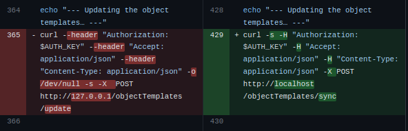

# Table of contents
1. [Introduction](#introduction)
2. [REMERCIEMENT](#remerciement)
3. [ORGANISATION](#organisation)
    1. [SECTEUR D'ACTIVITÉ](#secteur)
    2. [SERVICE](#service)
    3. [MÉTHODE DE TRAVAIL](#methode)
4. [PROJET DE STAGE ](#projet)
    1. [OUTILS UTILISÉS](#outil)
    2. [EXPLICATION](#explication)
    3. [MISP](#misp)
    4. [MISP-VAGRANT](#mispv)
    5. [MISP-PACKER](#packer)
    6. [APPORT](#apport)
5. [ROOM 42](#room)
5. [CONCLUSION](#conclusion)

# INTRODUCTION  

Dans le cadre de la formation de mon BUT informatique et de l'obtention de la deuxième année de ce diplôme, nous avions pour but, moi ainsi que l'ensemble de mes camarades, de trouver un stage d'une durée de 8 semaines au sein d'une entreprise informatique, au sein de laquelle nous allons être confrontés au monde du travail. Durant cette période de stage, chaque élève se trouve attribué par l'entreprise accueillante un sujet de stage qu'il devra, lors des 2 mois, essayer d'accomplir. Le choix de son stage est donc très important, car nous avons la possibilité de directement baigner dans le même bain que tous nos autres collègues qui, pour la plupart, sont là depuis un petit moment. De plus, cela pourrait constituer un choix crucial dans la poursuite de nos études. Nous avions peut-être un choix d'études fixé avant de commencer notre stage, et ce choix peut changer si l'on a choisi un stage en rapport avec nos choix et qui ne nous a pas plus finalement, ou au contraire, cela pourrait nous conforter dans nos choix.

Voulant m'orienter dans le domaine de la cybersécurité à la fin de mon BUT informatique, le fait de rechercher un stage en rapport direct avec ce monde était chose évidente. J'ai donc contacté l'entreprise CIRCL (Computer Incident Response Center Luxembourg) et ai été accepté à l'issue d'un entretien téléphonique avec mon tuteur de stage, Alexandre Dulaunoy.

CIRCL est une initiative gouvernementale luxembourgeoise créée en 2012 et qui est depuis 2014 une entreprise à but non lucratif. Cette dernière offre des services gratuits à des collectivités publiques et/ou privées pour leur venir en aide en cas d'incident de sécurité informatique ou simplement pour faire de la prévention, mais ce n'est pas leur seule activité. En parallèle, cette entreprise gère plusieurs projets d'envergure nationale et internationale. CIRCL a su se faire une réelle place dans le monde de la cybersécurité et est un acteur majeur dans ce domaine au Luxembourg. Sa rigueur, son professionnalisme et son sérieux leur ont permis d'évoluer depuis leurs débuts de manière constante, en commençant avec 8 salariés jusqu'à arriver à 38 aujourd'hui. C'est d'ailleurs cette évolution qui leur a notamment permis d'accueillir plusieurs étudiants par année en leur attribuant chacun un sujet qu'ils devront accomplir durant cette période, et je vais sans plus attendre vous expliquer brièvement le mien.

Ma mission lors de ce stage concerne l'un des nombreux projets de l'entreprise qui est MISP. Vulgairement expliqué, MISP est en quelque sorte le réseau social de la cybersécurité. Il va permettre aux personnes faisant partie de la communauté MISP d'en apprendre sur les nouvelles méthodes de cybersécurité, mais aussi sur les nouvelles méthodes de cyberattaques, tout en ayant par la même occasion la possibilité de publier ces informations. Mon travail sera donc relié à tout ceci. Le dossier de ce projet sur lequel je travaille est MISP-Vagrant. Ainsi, j'ai pour but de mettre à jour l'ensemble des fichiers le constituant. Ce travail est assez complexe, notamment à cause de la cohérence des versions des outils que je dois installer, car elle doit bien évidemment s'adapter au reste du grand projet MISP, donc beaucoup de modifications sont apportées. Pour travailler sur ce projet, j'ai été amené à utiliser des outils que je n'avais jamais utilisés auparavant, tels que Virtualbox ou encore Vagrant.

Pour vous présenter mon stage ainsi que mon projet de la manière la plus claire, nous allons tout d'abord commencer à parler de l'entreprise hébergeante afin que l'on ait un peu plus de détails. Nous poursuivrons par expliquer le fonctionnement de l'entreprise. Nous passerons ensuite par la présentation détaillée de mon projet et de tout le travail que j'ai accompli, et nous finirons enfin par une conclusion.

# REMERCIEMENT 

Avant de commencer à entrer dans le vif du sujet de mon stage, je tenais à présenter mes remerciements et ma gratitude envers un certain nombre de personnes. Je voudrais tout d'abord présenter mes remerciements et ma reconnaissance à mon tuteur de stage, M. Alexandre Dulaunoy, qui m'a accompagné de la meilleure des façons durant ma période de stage dans l'entreprise CIRCL (Computer Incident Response Center Luxembourg). Sa manière de travailler et sa manière de me suivre ont été, à mon sens, optimales pour le bon déroulement de cette expérience. Il a su me venir en aide tout en se mettant en retrait afin de me donner la possibilité d'en apprendre un maximum sur les outils que j'utilise, et selon moi, cela a été la meilleure manière d'entreprendre les choses.

Je voudrais aussi remercier l'ensemble du groupe CIRCL qui m'a extrêmement bien accueilli en me donnant directement l'impression de faire partie de leur équipe, en n'hésitant pas de la même façon que mon tuteur à me venir en aide par moments. Leur amabilité, leur cohésion d'équipe et leur hospitalité m'ont permis directement de me sentir à l'aise et de travailler dans une bonne ambiance, chose primordiale au vu du temps qui va être passé dans les locaux avec ces mêmes personnes. Je tiens à remercier mon professeur, M. Romain Jager, qui endosse le rôle de tuteur de stage à l'IUT. Ayant suivi ses enseignements durant l'année, je suis très reconnaissante de présenter ma soutenance devant un professeur que j'admire pour ses méthodes d'enseignement et sa volonté de faire réussir ses élèves.

Pour continuer sur les professeurs qui me tiennent à cœur de remercier, nous avons Mme. Marie-Aimée Coquillat qui a entrepris un travail constant tout au long de l'année et m'a beaucoup aidée lors de ma recherche de stage, M. Pierre Laroche qui a assuré toutes les procédures administratives très rapidement et très efficacement tout en répondant à toutes les questions que l'on se posait lors du remplissage des différents formulaires, chose que j'ai eu la chance de retrouver aussi au sein de mon entreprise grâce à Mme. Rita Bressanutti qui n'a pas hésité à me donner des indications sur le fonctionnement de l'entreprise, à me faire visiter les locaux et à veiller à ce que tout se passe bien pour moi, chose pour laquelle je lui suis énormément reconnaissante. Enfin, pour finir, je tenais bien sûr à remercier Mme. Anne Spengler qui prend à cœur de suivre chacun de ses étudiants et qui travaille dur depuis notre rentrée en première année pour nous faciliter au mieux l'entrée dans cette nouvelle réforme du Bachelor Universitaire de Technologie (BUT), anciennement Diplôme Universitaire de Technologie (DUT).

Nous pouvons, après avoir passé ce point important, entrer dans le vif du sujet.

# ORGANISATION 

## SECTEUR D'ACTIVITÉ 
L'entreprise Computer Incident Response Center, également appelée CIRCL, est une initiative gouvernementale lancée en 2012 par le gouvernement luxembourgeois opérant dans le domaine de la cybersécurité dans le but de proposer un service de réponse aux menaces de sécurité informatique pour les entités non gouvernementales, les entreprises privées et les collectivités, afin de minimiser les pertes potentielles liées à ces attaques.

Cette organisation est gérée par SMILE (Security Made in Lëtzebuerg), une initiative publique et privée visant à promouvoir la sécurité informatique dans le pays tout en stimulant le développement de l'industrie pour laquelle cette même entreprise fait la promotion, à savoir encore une fois la sécurité informatique.

La mise en place de CIRCL il y a une dizaine d'années était un réel coup de génie compte tenu des progrès considérables réalisés en informatique, car depuis sa création, cette dernière ne fait que croître et continue d'être un acteur majeur dans le domaine et de travailler au niveau national et international. Pour mener à bien toutes ces actions, l'entreprise est composée de plusieurs spécialistes en sécurité informatique qui sont en mesure de fournir rapidement, efficacement et précisément des réponses aux différents incidents susceptibles d'être rencontrés par les personnes en détresse qui font appel à ces services. Par conséquent, elle vise à apporter des solutions réelles et joue le rôle de "protectrice" en matière informatique au Luxembourg.

Nous pourrions penser qu'une telle entreprise serait nécessairement payante compte tenu de l'aide qu'elle apporte et du fait que nous sommes actuellement dans une ère où l'informatique occupe une place prépondérante dans nos vies, que ce soit dans le cadre du travail, des loisirs ou même de nos objets personnels (objets connectés : smartwatch, smartTV, smartFridge...), ce qui accroît considérablement le risque que n'importe qui puisse nuire à nos données à caractère personnel. Mais détrompez-vous : depuis 2014, CIRCL est une entreprise à but non lucratif, motivée par la promotion de la sécurité informatique au Luxembourg.

Outre le fait que cette société vienne en aide à ceux qui le demandent en cas de cyberattaques, elle s'occupe également de la mise en place de certains projets et de leur maintien à long terme. En voici trois exemples :

- CIRCLean : Cet outil a été développé dans le but de nettoyer automatiquement les fichiers malveillants, et il est utilisé par d'autres entreprises.
- Cyber Threat Intelligence : Il s'agit de la collecte d'informations sur les attaques et menaces informatiques à travers le monde, dans le but de les partager avec le plus grand nombre possible de personnes en les publiant sur des plateformes de partage d'informations telles que MISP, ce qui nous amène au troisième exemple.
- MISP : MISP est une plateforme de partage d'informations dans laquelle les différentes organisations partagent des informations sur les attaques et les menaces dans le but de mieux les comprendre et de mettre en place de nouvelles mesures pour mieux les contrer.

##SERVICE 

Comme vous l'aurez maintenant compris, CIRCL se tient à entière disposition des entreprises luxembourgeoises et même au-delà, comme j'ai pu le constater. Des entreprises se retrouvant dans des situations délicates de cyberattaques vont contacter cette organisation qui va directement les prendre en charge en identifiant tout d'abord l'entreprise victime, puis en leur dictant les premiers gestes à avoir afin de minimiser de manière significative les dégâts engendrés et pourront ainsi les accompagner tout au long du processus dans un gage de qualité afin de leur apporter le plus d'aide possible. C'est d'ailleurs l'une des raisons pour lesquelles CIRCL s'est fait un réel nom dans ce secteur, mais pas simplement car outre le fait que cette société vienne en aide à ceux qui le demandent en cas de cyberattaques, elle s'occupe également de la mise en place de certains projets et de leur maintien à long terme, qui existent déjà depuis plusieurs années et qui perdureront dans le futur.

## MÉTHODE DE TRAVAIL 

Vous l'aurez assimilé, CIRCL va s'occuper de gérer la gestion de plusieurs tâches simultanément. Nous pourrions penser que chacun a une tâche bien précise à accomplir et uniquement cette tâche, mais contrairement à la grande majorité des entreprises, CIRCL ne fonctionne pas de la même manière. Cette dernière est composée de 16 personnes très compétentes mais aussi tout aussi polyvalentes. De ce fait, ils ont la possibilité de chacun faire plusieurs tâches si cela venait à se présenter.

Ainsi, l'entreprise gère la gestion de plusieurs tâches simultanément et pour gérer correctement ces différentes tâches, le travail est réparti en plusieurs parties. Nous avons tout d'abord une partie où ils s'occupent des recherches, portant sur les dernières actualités en termes de criminalité informatique et de l'élaboration des derniers outils pouvant être utiles à la sécurité informatique. Nous avons ensuite une partie portant sur le développement de la plateforme MISP que nous avons évoquée précédemment. Ils s'occupent ainsi du maintien de la plateforme et de l'apport d'améliorations si possible. Continuons avec la fonction principale de cette entreprise, à savoir la réponse aux incidents et bien évidemment, il va de soi qu'une partie y soit consacrée afin de répondre aux signalements de différentes organisations, qu'elles soient gouvernementales, privées ou encore des particuliers. Pour rester dans le même esprit, une section va être mise en place afin de mener une campagne de sensibilisation face aux incidents de sécurité informatique auprès des entreprises et en proposant également une formation pour renforcer leur riposte en cas d'acte malveillant envers leur service informatique. Enfin, pour que tout ceci puisse convenablement se coordonner, la gestion de projet doit nécessairement être mise en place, et c'est chose faite car une partie est basée sur le fait de s'occuper de tout ce qui se rattache à la gestion de projet, allant de la planification à la mise en place du projet, et ce pour l'ensemble des projets CIRCL.

Avec les années cette organisation s'est fait une réelle place dans le monde de la cybersécurité grâce à ses services qualitatifs, ses projets de grande envergure, son étroite collaboration avec un bon nombre d'entreprises qu'elles soient privées ou publiques, son organisation et sa manière de travailler, le tout appuyé par le fait que ce ne soit pas une société à but lucratif mais qui apporte des solutions rapides et claires.

Maintenant que vous vous êtes familiarisé avec cette organisation en apprenant davantage sur ses spécificités, sa création, sa structure sociale et ses projets, nous pouvons passer à la présentation et à l'explication de mon projet de stage.

# PROJET DE STAGE 

## OUTILS UTILISÉS 

Bien évidemment, au vu de mon sujet de stage, je ne serai pas amené à utiliser des switchs ou des routeurs ou ce genre de choses que l'on a pu pratiquer de nombreuses fois en travaux pratiques de réseaux avancés, par exemple, mais à manipuler exclusivement grâce à un ordinateur comme en cours de virtualisation, par exemple. De ce fait, un ordinateur portable sur lequel je travaille sous Ubuntu 22.04 est le seul outil matériel qui m'a été fourni. En termes de logiciel, j'ai été amené à utiliser principalement Vagrant et VirtualBox.

J'ai par ailleurs utilisé d'autres outils suite aux conseils avisés de mon tuteur, tels que HedgeDoc qui me permet de mettre en page chaque jour les tâches accomplies, en donnant la possibilité par la même occasion à mes collègues de voir mon avancée et d'apporter des modifications à ce que j'ai fait. Mais ce n'est en revanche pas le seul outil de collaboration utilisé. On m'a proposé d'utiliser Element afin d'échanger avec chacune des personnes présentes ou avec elles toutes en même temps, afin d'avoir des réponses rapides. L'ensemble de ces outils va me permettre de modifier le dossier misp-vagrant qui regroupe l'ensemble des fichiers sur lesquels je dois travailler lors de mon projet.

Par conséquent, voici l'ensemble des outils que j'ai dû apprendre à utiliser :

    Vagrant : Vagrant est un outil open source qui a pour but de gérer la création et la configuration de machines virtuelles. Ainsi, il rend possible la configuration, la création et la gestion d'environnements de développement virtuels qui permettent d'exécuter des tâches de développement et de test, de tester des applications et aussi pour toute autre manipulation requérant l'emploi de développement stable et reproductible. C'est un outil nous permettant de créer des machines virtuelles à partir de modèles qui sont préconfigurés et que l'on appelle des box. En bref, il permet aux utilisateurs la création simple et rapide d'un environnement de développement reproductible qui permettrait de réduire par conséquent les erreurs de configuration tout en facilitant le travail collaboratif.

    VirtualBox : Ce logiciel open source de virtualisation de système d'exploitation permet à notre ordinateur de créer et gérer des machines virtuelles, offrant ainsi la possibilité d'exécuter et de tester plusieurs systèmes d'exploitation sur une seule et unique machine physique. L'utilisateur peut donc installer différents systèmes d'exploitation tels que Linux, macOS ou encore Windows. Chacune de ces machines virtuelles possède ses propres ressources et configurations, et aucune d'entre elles n'a accès aux fichiers pouvant être présents sur la machine hôte, ce qui signifie que les tests se font de manière complètement isolée.

    HedgeDoc : Cette application de prise de notes et de collaboration est un projet open source accessible via un navigateur web. Elle permet de faire de multiples choses, telles que la prise de notes seule ou en collaboration simultanée, étant un outil collaboratif. Elle permet également, lors de la prise de notes, la création de tableaux, de listes, de diagrammes de Gantt, d'ajouter des commentaires et bien d'autres fonctionnalités. C'est donc un outil de collaboration en ligne facile à utiliser et offrant de multiples fonctionnalités.

    Element : Element est un outil de communication instantanée permettant à ses utilisateurs de communiquer par appel vidéo, audio et par messagerie, que ce soit individuellement ou en groupe. Il est disponible sur plusieurs systèmes d'exploitation et offre des fonctionnalités avancées en termes de sécurité et de confidentialité.

    misp-vagrant : Misp-vagrant est un environnement de développement virtuel qui a été spécialement pré-configuré pour le système de prévention des incidents de sécurité informatique qu'est MISP. Ainsi, il permet la création et l'installation locale de MISP pour le tester, bien sûr, en utilisant une machine virtuelle basée sur Vagrant, afin que cela n'affecte en rien la machine hôte.

    Langage de programmation Markdown pour rédiger mon rapport intermédiaire de stage.

J'ai bien sûr utilisé d'autres outils que je connaissais, tels que Git ou encore le langage de programmation Bash, dans lesquels j'ai quelques difficultés.

Du fait qu'il n'y a pas beaucoup de nouveaux outils matériels et/ou logiciels, instinctivement, une personne peut penser que l'apprentissage de l'utilisation de ces équipements n'est pas si compliqué, mais c'est uniquement lorsque l'on entre dans le vif du sujet que nous mesurons la difficulté, chose que nous allons analyser directement au point suivant.

## EXPLICATION 

Voici l'intitulé de mon sujet tel qu'il m'a été présenté lorsque je faisais mon choix : "MSc Student Internship Position - Improvement of Virtualisation and Orchestration of Training Infrastructure", qui se traduit par "Poste de stage pour étudiant en Master - Amélioration de la virtualisation et de l'orchestration de l'infrastructure de formation". Comme vous pouvez le remarquer, ceci n'est pas un sujet qui est directement adapté à mon niveau d'études, mais lors de mon choix de sujet parmi tous les sujets qui m'étaient proposés, ce sujet m'attirait et m'intéressait plus particulièrement. Hormis le fait que cela soit un sujet extrêmement intéressant, il constitue un réel défi pour moi, car si j'arrive à terme de ce sujet, cela serait extrêmement gratifiant et dans le cas où le niveau serait beaucoup trop élevé pour moi, je pourrais tout de même en retenir que de bonnes choses, car cela m'aura permis de me dépasser en me poussant dans mes retranchements. J'aurais par la même occasion énormément appris, tant par mes recherches que par les manipulations des différents outils qui m'étaient possibles d'utiliser.

À l'écoute de l'intitulé de mon sujet, on ne peut pas directement savoir en quoi consiste ce dernier, chose que je vais maintenant vous expliquer de manière simplifiée.

Il m'est confié comme mission de mettre à jour un dossier composé de plusieurs fichiers de configuration. Dans ce dossier, sont présents plusieurs fichiers, mais je vais travailler sur deux fichiers en particulier. Ce dossier se nomme Misp-Vagrant et est une petite pierre dans l'édifice qu'est MISP, un projet dont on a fait mention précédemment et sur lequel nous allons nous intéresser plus longuement.

## MISP 

MISP est une plateforme de partage mise en place il y a plusieurs années et qui compte aujourd'hui des milliers d'utilisateurs. L'idée de l'élaboration de cette plateforme s'est faite en 2012 suite à une séance de travail durant laquelle a été remarqué le fait que plusieurs personnes au sein de ce groupe de travail travaillaient sur le même logiciel malveillant. Suite à la découverte qu'ils travaillaient tous les deux sur le même sujet, ils ont eu l'idée de vouloir mettre en place une plateforme leur permettant d'échanger leurs connaissances pour minimiser le temps de travail, mais aussi d'éviter la duplication. Ainsi, Christophe Vandeplas, qui travaillait à ce moment-là au CERT pour le ministère belge de la Défense, a présenté son travail qui deviendra par la suite MISP. Pour rappel, Circl est une initiative gouvernementale et est donc considéré en tant que CERT (Computer Emergency Response Team) dans ce pays. Par conséquent, CIRCL est à la tête de cette plateforme open source MISP et gère donc un bon nombre de communautés de partage MISP se basant sur le partage d'informations concernant les menaces et ce de manière active.

Mais concrètement, qu'est-ce que MISP ?
Vous l'aurez bien compris au vu de mes explications précédentes, MISP est une plateforme de partage dans le domaine de la cybersécurité. Ainsi, elle permet le partage d'informations sur les nouvelles menaces. C'est bien sûr un logiciel open source, c'est-à-dire dont le code est visible publiquement, pouvant être ainsi consulté, modifié et partagé par tout le monde. Il facilite ainsi la collaboration et l'échange d'informations entre plusieurs communautés, nous permettant ainsi de mettre en relation nos informations, mais plus important encore, de les enrichir. Nous n'avons pas tous les mêmes façons de développer et de travailler, et avoir un point de vue et une méthode de travail externe à la nôtre est essentiel en informatique. Conséquemment, on peut relever en quelque sorte différents groupes de divulgation d'informations. Nous avons par exemple les analystes de fraude qui vont partager des indicateurs financiers afin de pouvoir relever des fraudes financières. Nous avons aussi dans le thème les analystes de sécurité qui vont avoir pour rôle de tout d'abord rechercher des indicateurs, bien sûr toujours dans un contexte de sécurité opérationnelle. Ils continueront ensuite par les valider pour ensuite, bien évidemment, les utiliser. Je voudrais tout de même vous présenter un dernier type d'utilisateur, car nous pouvons penser qu'avec les exemples que je viens de vous présenter, seules les personnes directement liées à la cybersécurité utilisent cette plateforme, mais ne perdons pas de vue le but principal de ce projet, bien sûr le partage d'informations, mais plus précisément en termes de sécurité de l'information, donc nécessairement de cybercriminalité, qui sont donc des fraudes et toute fraude doit obligatoirement être punie par la loi. Ce qui nous amène à notre troisième et dernier exemple d'utilisateur qui ne sont autres que les forces de l'ordre, qui vont s'appuyer sur les indicateurs partagés par les experts en cybersécurité afin de soutenir ou encore d'initier leurs enquêtes, leur permettant de répondre de la meilleure manière possible aux incidents. Et à mon sens, c'est à partir de ce moment-là que nous voyons réellement l'aboutissement des recherches entreprises et communiquées par ces personnes. Elles participent activement à la sécurité de tous, et c'est à mon sens une réelle gratification pour elles de œuvrer à la sécurité de la population. Car bien sûr, les forces de l'ordre ne sont pas les seuls organismes de confiance utilisant les services de MISP. Nous avons par exemple le service militaire ou encore le secteur de la finance.

## MISP-VAGRANT 

Misp-vagrant est un projet open-source qui apporte la possibilité d'effectuer le déploiement d'une instance MISP et ce de manière très rapide. Et pour cause, ce projet utilise la technologie de la virtualisation dans le but de créer un environnement de déploiement virtuel prêt à l'emploi.

Pour vous expliquer concrètement comment MISP-Vagrant se compose, il s'agit d'un ensemble de scripts et de fichiers de configuration. L'ensemble de tous ces fichiers va permettre la création d'une machine virtuelle avec MISP directement préinstallé.

Le gros avantage de la mise en place de MISP-Vagrant est le gain de temps énorme pour l'utilisateur. Par conséquent, la grande efficacité de cet outil permet aux utilisateurs de se lancer dans un travail sur l'instance MISP sans pour autant être freinés par la configuration ou encore l'installation manuelle qui prend généralement du temps et qui est dans certains cas assez complexe. Il leur suffira de cloner le dépôt Git qui a été mis en place, ainsi que quelques lignes de commande. En somme, le but de cette solution s'inscrit dans une démarche de simplification pour les utilisateurs en fournissant une solution déjà prête à l'emploi et bien sûr basée sur une machine virtuelle afin que cela n'affecte en rien la machine hôte.

### QU'EST-CE QUE J'AI FAIT ?

Maintenant que vous vous êtes familiarisé avec la notion de MISP-Vagrant, voyons quelle était la liaison entre ceci et mon projet de stage.
MISP est un projet de très grande envergure. Misp-vagrant est une pierre constituant cet édifice, mais ce n'est pas le seul. Et comme nous le savons, les progrès informatiques sont gargantuesques et surtout très rapides. Du fait de la vitesse des progrès ces dernières années, du nombre et de la complexité des projets, nous n'avons pas forcément la possibilité de remettre de manière vraiment régulière l'ensemble des codes de tous les projets MISP, et c'est notamment le cas pour ce projet.
Les dernières modifications sur ce projet datent déjà de quatre ans. C'est pourquoi mon but est donc de remettre à jour l'ensemble des fichiers composant ce dossier, chose qui a l'air très simple en apparence, mais qui est beaucoup plus complexe lorsqu'on se penche sur le sujet.
Voici le dépôt git actuel.

Vous l'aurez compris, je travaillerai principalement sur deux fichiers, à savoir Vagrantfile et bootstrap.sh. Je vais donc vous présenter quelle est l'utilité de chacun de ces fichiers afin de vous expliquer les modifications apportées.

### EXPLICATION DÉTAILLÉE

#### VAGRANTFILE

Le fichier Vagrantfile vous permet de personnaliser divers aspects de la machine virtuelle, tels que la configuration réseau, la mémoire, le nombre de CPU, les partages de dossiers, etc. Il peut également inclure des scripts de provisionnement pour installer et configurer MISP sur la machine virtuelle.

Commençons par l'explication du fichier Vagrantfile. Ce dernier est un fichier offrant la possibilité à son utilisateur de procéder à la personnalisation de certains aspects concernant la machine virtuelle, comme par exemple la mémoire, les partages de dossiers ou encore la configuration réseau. Il inclut par ailleurs des scripts de provisionnement pour aboutir à l'installation et à la configuration de MISP sur sa machine virtuelle.
Pour arriver à mes fins, j'ai personnellement utilisé ce fichier afin de mettre à jour la version d'Ubuntu installée.
Pour l'avancée et la mise à jour de Misp-vagrant, je devais mettre à jour la version d'Ubuntu devant être installée, ce qui est essentiel.

Ce fichier m'a permis de mettre à jour la version d'Ubuntu installée et je vais vous expliquer tout d'abord quelle est la version d'Ubuntu installée et pourquoi devrais-je la changer, quelle version a été installée et enfin comment je l'ai installée.
Tout d'abord, la version d'Ubuntu installée actuellement sur ce projet est la version 18.04, qui date du mois d'avril de l'année 2018. À ce moment-là, le grand projet MISP fonctionne en se basant sur cette version, mais depuis, il y a eu quelques changements et la version d'Ubuntu installée en fait partie et est très importante, car selon les versions d'Ubuntu installées, la configuration et les versions des outils que l'on va installer par la suite seront susceptibles de changer. La dernière version d'Ubuntu actuellement disponible est la 22.04, mais bien que ce soit la dernière version installée, ce n'est pas celle que nous serons amenés à installer, ce qui nous amène par conséquent au deuxième point, à savoir la version à installer. Malgré le fait que la dernière version soit la 22.04, nous allons installer la version 20.04 d'Ubuntu, et il y a une cause à cela. Comme nous l'ont précédemment expliqué, la version initialement installée est la version 18.04, car c'était la version qui était en corrélation avec l'ensemble du projet MISP, et c'est ici la même chose qui va se reproduire. Nous installons donc la version 20.04 et pas la dernière, car c'est la version qui est en adéquation avec l'ensemble du grand projet. Vous vous demandez donc très certainement comment pouvons-nous procéder à l'installation de ces versions, et c'est le sujet de notre dernier point. Pour l'installation, je n'ai pas procédé traditionnellement, et j'entends par là le fait de rechercher sur un moteur de recherche ce que je veux installer et de l'installer directement par la suite. J'ai, pour ce faire, fait une modification au sein du code Vagrantfile en changeant l'image Ubuntu. Une image Ubuntu se définit par la représentation numérique d'une installation complète d'Ubuntu, en comprenant évidemment le noyau du système, les configurations par défaut, les logiciels préinstallés et les pilotes. Donc, l'appellation d'une image varie selon la version d'Ubuntu voulant être installée. Voici le code permettant l'installation de la version 18.04 :

Et voici maintenant le code permettant l'installation de la version dont nous avons besoin, à savoir la 20.04 :

Mis à part ce changement, un autre changement, pratique pour moi, est le changement du nom de la machine virtuelle. Du fait du nombre de tests effectués, avoir plusieurs machines virtuelles avec le même nom est très contraignant, c'est pourquoi le nom était toujours changé.
C'est globalement toutes les modifications qui ont été faites sur ce fichier et nous pouvons maintenant passer au deuxième fichier.

#### BOOTSTRAP.SH

Nous passons maintenant au fichier le plus complexe avec le plus de modifications.
La complexité de ce fichier est très facilement explicable car elle comporte la plus grande partie de la configuration. Nous avons certes dans le fichier Vagrantfile mis à jour Ubuntu en le passant de 18.04 à 20.04 et nous pourrions penser que l'on a fait une très grande partie du travail, mais c'est loin d'être le cas. Au sein de ce deuxième document, nous retrouvons l'ensemble de la configuration et de l'installation des outils essentiels au déploiement de l'instance MISP.
Comme nous l'avons précédemment dit, le fait de changer la version d'Ubuntu installée aura nécessairement des conséquences sur les outils installés et leurs versions. C'est une chose que j'ai pu remarquer très rapidement dès le début des tests et des manipulations que j'ai pu faire. Et pour cause, ce fichier contient la configuration et l'installation d'un bon nombre d'outils. Comme vous vous en doutez, le changement d'image et les versions des outils installés ne vont plus correspondre, et c'est à ce moment-là que mon travail débute.
Je dois donc, pour ma part, analyser pour chacun des outils installés leur version ainsi que leur configuration actuelles. J'examine au vu des erreurs que je reçois lors de l'exécution si je rencontre un problème, et finalement je modifie correctement mon script afin que tout soit en corrélation avec l'ensemble du reste du projet MISP et de la version 20.04 nouvellement installée. C'est un exercice assez complexe qui demande à la fois de bonnes connaissances en bash et en scripting Unix tout en recherchant quelles sont les versions adéquates.
J'ai ainsi changé une bonne partie du code et les ai longuement testés.
Commençons par la version de PHP qui est installée, qui est initialement la version 7.2 pour Ubuntu 18.04, mais qui est dorénavant la version 7.4. J'ai donc été contrainte de changer certains bouts de code :

PHP :

    
    Voici les modifications apportées à la configuration de PHP par défaut :
    
    
    Plusieurs modifications ont été faites ici afin d'apporter plus de fonctionnalités :
    Tout d'abord, il y a eu l'ajout de la première fonctionnalité qui n'est autre que la validation de la valeur de configuration afin de veiller à ce que notre valeur corresponde correctement au format spécifique. Dans ce cas, la valeur qui devrait nous être retournée est suivie d'un "M" ou d'un "m". Bien sûr, après la modification de cette valeur, un message de confirmation est retourné afin que l'on ait une idée de l'état d'avancement.
    Pour continuer, une vérification d'existence de nos fichiers a été mise en place pour, au vu du nom que je lui donne, permettre de vérifier si les fichiers de configuration sont bel et bien existants. Un message est retourné selon le résultat obtenu, tout comme pour la vérification des valeurs.
    Enfin, l'utilisation de la commande "sudo" pour l'exécution de la commande "sed" a été nécessaire dans le cas où l'utilisateur nécessite des privilèges afin de modifier le fichier de configuration.
    
    Ici aussi, plusieurs modifications ont été apportées, plus précisément trois :
    Tout d'abord, nous avons modifié la commande "sudo -u www-data -H git submodule init" en la remplaçant par "sudo -u www-data -H git submodule update --init --recursive" et ce pour permettre la mise à jour des sous-modules git de CakePHP, ce qui permet la récupération des versions les plus récentes des sous-modules pour être sûr que toutes les dépendances sont correctement initialisées.
    La deuxième modification concerne aussi le changement d'une ligne de commande déjà existante. Nous avons modifié cette ligne de commande "sudo -u www-data -H php composer.phar install" par celle-ci "sudo -u www-data -H php composer.phar install --no-cache --no-dev" avec l'option "--no-cache" ayant pour but d'indiquer à Composer de ne pas utiliser de cache lors de l'installation, ce qui peut être pratique pour acquérir les versions les plus récentes.
    Enfin, la dernière modification apportée ici est une permission qui permettra à l'utilisateur "www-data" d'être en mesure d'accéder et surtout d'utiliser le cache Composer.

PYTHON :

       
    Ici, nous installons les paquets de base et la modification apportée concerne la version de Python. Nous avons spécifié que la version de Python que l'on va installer est la 3.7.

MISP :
J'ai par la suite relevé des erreurs dans le code liées directement à MISP.
CHERCHER DES BOUTS DE CODE EN RAPPORT AVEC PHP, PRENDRE UNE CAPTURE D'ÉCRAN ET LES METTRE ICI :

    
    Sur ce bout de code, deux fonctionnalités sont essayées. Tout d'abord, nous essayons de changer de répertoire courant vers celui qui est spécifié dans la variable "$PATH_TO_MISP", donc le chemin '/var/www/MISP'. Si cela n'aboutit pas, 1 sera retourné en guise d'erreur. Ensuite, nous tentons la vérification afin de voir si le répertoire courant Git est valide. Si ce n'est pas le cas, un message d'erreur est retourné.
    
    
    Les modifications ici sont très simples à discerner et à comprendre. Nous avons modifié la version des packages Python installés en spécifiant que la nouvelle version de Python est la version 3.7. Puis, nous avons ajouté deux fois dans notre code la commande "sudo" afin de simplement spécifier que ces commandes doivent être exécutées en tant que root.

MITRE'S STIX :
    
    Nous arrivons maintenant à la partie du code qui, à mon sens, a été le plus modifiée, et je vais vous expliquer en détail toutes les modifications qui ont été apportées.
    Tout d'abord, nous avons mis à jour les paquets disponibles avec la modification de la ligne de commande "apt-get update".
    Nous avons ensuite spécifié la version de Python, puis des vérifications portant sur l'existence de répertoires ont été faites au préalable de certaines opérations.
    Pour continuer sur les vérifications, une nouvelle vérification est effectuée avant de procéder au clonage des dépôts git afin de vérifier si la destination est la suivante : "/var/www/MISP/app/files/scripts/python-cybox". Si celui-ci existe, il est supprimé.
    Ensuite, le clonage des dépôts git de "python-cybox", "python-stix" et "mixbox" s'effectue, et l'utilisation de la commande "git checkout" va permettre aux deux premiers dépôts que j'ai cités de basculer sur une version spécifique.

GALAXIES :
    
    
    Les modifications sont assez minimes, mais elles ont tout de même leur importance.
    Tout d'abord, nous avons modifié l'option "--header" par "-H" pour indiquer les en-têtes de requêtes, mais aussi pour apporter une meilleure lisibilité du code.
    Ensuite, nous avons supprimé l'option "-o /dev/null" afin de spécifier que la réponse ne sera pas redirigée vers "/dev/null".
    Enfin, nous avons modifié "-s" pour ne plus afficher la progression et les informations supplémentaires qui s'affichent normalement lors de l'exécution de la requête.
    Enfin, nous avons modifié "http://127.0.0.1/galaxies/update" par "http://localhost/galaxies/sync" dans le but de synchroniser les galaxies.
    Ces modifications sont semblables dans ces trois autres bouts de code :
    
    
     

Pour apporter une dernière précision, je voudrais vous détailler la manière dont j'avais l'habitude de travailler, car pour une personne qui n'est pas habituée à ce genre de travaux, cela peut être quelque peu perturbant.
Pour contextualiser, nous avons un projet sur lequel nous travaillons principalement avec deux fichiers, bootstrap.sh et Vagrantfile.
J'ai donc cloné le dépôt Git où se trouve mon projet sur mon ordinateur. J'ai également installé VirtualBox par la même occasion.
Toutes les modifications que j'ai entreprises ont été faites sur ma machine hôte (donc bootstrap.sh et Vagrantfile). Dès que je voulais tester si les modifications que j'ai apportées ont fonctionné, j'entrais la commande "vagrant up" pour démarrer ma machine virtuelle en me basant sur la configuration que j'ai faite dans Vagrantfile. Cela confirme les explications que je vous ai données au sujet de Vagrantfile, où je stipule que ce fichier me permet de changer le nom de ma machine virtuelle. Nous avons donc ici la démonstration.
Ensuite, j'effectuais la commande "vagrant provision" afin d'exécuter mon script (bootstrap.sh), ce qui me renverrait tous les résultats et me permettrait ainsi de relever les erreurs et d'essayer de les résoudre.
Voilà une bonne description assez détaillée du travail que j'ai pu effectuer sur le projet Vagrant. Malgré mes heures de travail sur ce projet, celui-ci n'a pas pu être mené à terme en raison de sa grande complexité (pour mon niveau d'études) et du temps qui m'a été accordé pour sa réalisation. C'est pourquoi, au cours de ma cinquième semaine de stage, mon tuteur a décidé de m'attribuer un autre projet qui est semblable à celui-ci, mais qui est tout de même très différent, et nous allons le voir sans plus attendre dans la partie suivante.

## MISP-PACKER 

Maintenant que nous avons fait une étude détaillée sur le projet Misp-Vagrant, passons à l'analyse du second projet qui a été étudié et cette fois réussi à être fini. Pour ce faire, nous allons tout d'abord chercher à savoir ce qu'est Misp-packer, et nous continuerons par expliquer ce que j'ai pu réaliser, et enfin les modifications que j'ai apportées dans ce projet.

Misp-packer, comme l'outil présenté précédemment, est un projet open-source mis en place par l'équipe qui s'occupe du projet MISP. Celui-ci a pour utilité la création d'images virtuelles préalablement configurées, contenant l'installation de MISP prête à l'emploi, et prenant en charge plusieurs plateformes de virtualisation telles que VMWare, VirtualBox, et bien d'autres encore.
Du fait de l'utilisation de cet outil et de la création d'images virtuelles MISP déjà prêtes, la manipulation ainsi que toutes les configurations manuelles ne seront pas utiles, car tout aura été préalablement effectué, permettant ainsi un déploiement très rapide de MISP.
Afin de spécifier les paramètres de son image virtuelle, Misp-packer va utiliser des fichiers de configuration, là où d'autres distributions ont par exemple utilisé des certificats SSL, des paquets à installer, ou encore des clés API. Ainsi, la configuration de cet outil est beaucoup plus simple, et nous pouvons même changer l'image en ajoutant ou tout simplement en modifiant un script déjà existant.
Pour conclure, nous pourrions définir ce projet comme un moyen de faciliter et d'accélérer le déploiement de MISP en créant des images virtuelles préalablement configurées, et en fournissant une installation complète prête à l'emploi, afin que l'utilisateur n'ait pas à effectuer l'ensemble des manipulations manuellement.

### QU'EST-CE QUE J'AI FAIT ?

Les bases posées et les termes éclaircis, nous pouvons dès à présent mettre les pieds dans le plat.
Nous disons souvent que "Les petits ruisseaux font les grandes rivières", et vous l'aurez très bien assimilé au vu de l'avancée de votre lecture. Les projets que j'ai entrepris sont en rapport avec le projet MISP. Il a été très gratifiant de contribuer à ce grand projet, même si les projets entrepris sont minimes en comparaison de l'importance de ce grand projet. Car chaque maillon de la chaîne compte, passons sans plus tarder à l'explication dans les grandes lignes de ce que j'ai pu faire pour ce travail, pour ensuite passer à une explication détaillée de ce que j'ai fait.

Pour mener à bien ce projet, j'ai décidé de fonctionner de la même manière dont j'ai procédé depuis le début de mon stage. J'ai donc découpé l'organisation de mon travail en trois parties. J'ai tout d'abord entrepris des recherches pour en savoir davantage sur le sujet, dans le but de partir sur des bases solides qui me permettront de répondre à mes propres questions sans grand souci. Par la suite, je suis passé à la phase de test, ce qui consiste à faire des changements à plusieurs endroits dans plusieurs fichiers afin de voir ce qui peut me être retourné. C'est ainsi le moment de faire le plus de manipulations possibles afin d'analyser le plus de possibilités. Enfin, je finis par la phase purement pratique, qui me permettra d'allier les connaissances que j'ai pu accumuler lors de mes recherches, ainsi que celles de la phase de test, qui me guidera dans les choses à faire ou non. Contrairement au projet précédent, je ne travaille pas principalement sur un ou deux fichiers de configuration, mais sur plusieurs. Je dois donc avoir une assez bonne connaissance de chacun des fichiers que je serai amené à utiliser ou non, mais le but reste tout de même le même, à savoir la mise à jour de l'ensemble des fichiers.
Pour finir, je voudrais apporter une clarification sur la manière dont j'ai été amené à travailler, pour que vous puissiez vous faire une idée plus précise.
J'ai besoin, pour la réalisation de ce travail, indubitablement de VirtualBox. J'ai tout d'abord cloné le dépôt git du projet déjà existant sur mon ordinateur. Ensuite, je vais apporter des modifications toujours sur ma machine hôte, et dès que je décide de tester ces modifications, j'exécute la commande "bash build_vbox.sh", toujours sur ma machine hôte. Puis, lorsque l'exécution de mon travail est terminée, c'est seulement à ce moment que je suis amené à utiliser la machine pour simplement voir si les modifications que j'ai apportées ont abouti.

Après ce court préambule, nous pouvons passer à une explication plus précise des modifications apportées. Pour ce faire, nous allons analyser le code initial et les changements apportés, mais surtout dans quel but elles ont été apportées.

### EXPLICATION DÉTAILLÉE

CONFIG.SH:
     
    
La seule et unique modification qui a son importance dans ce code a pour but la modification de la version d'Ubuntu que l'on va utiliser au moment de la création de l'image virtuelle. Pour ce faire, j'ai donc ajouté la variable "UBUNTU_VERSION="20.04"", l'ajout de cette variable va permettre l'indication que c'est la version que l'on a spécifiée qui doit être employée lors de la création de l'image, à savoir ici la version 20.04. Ainsi, cette modification participe activement à la mise à jour de la version d'Ubuntu.

MISP.JSON:
Il y a eu dans ce fichier beaucoup de modifications, mais toutes ne sont pas cruciales. Pratiquement l'intégralité de ce code a été modifiée dans le but de le rendre plus agréable à lire, et nous ne nous attarderons pas sur ces modifications, mais analyserons seulement celles qui sont réellement importantes lors de l'exécution de notre code.
Voici les modifications qui sont importantes dans ce code:

     
    
    
La première modification a pour but de changer le nom de l'ISO que l'on va utiliser pour la nouvelle version d'Ubuntu qui sera installée. Nous sommes ainsi passés de "iso_name": "ubuntu-18.04.6-server-amd64.iso" à "iso_name": "ubuntu-20.04.6-server-amd64.iso". Nous notifions ici précisément que nous passons de la version 18.04.6 d'Ubuntu à la version 20.04.6.
La seconde modification apportée ici est la valeur "iso_url" qui indique, comme son nom l'indique, l'URL de la version de l'ISO que nous souhaitons télécharger. En corrélation avec le nom de l'ISO qui a été changé d'une version à une autre, nous passons de la version 18.04.6 installée à la version 20.04.6.
Ces modifications sont cruciales pour la mise à jour de la version d'Ubuntu installée, car comme expliqué précédemment, l'installation d'autres distributions impose d'installer des packages et bien d'autres choses. Nous avons donc besoin de télécharger l'image ISO de la version que nous désirons, afin que tout puisse se mettre à jour selon notre convenance.

INTERFACE.SH:

    
    
Ici, la modification est minime mais a tout de même son importance. Nous avons remplacé la commande "sed" et avons ajouté l'option "-i" à cette commande, soit "sed -i". La raison pour laquelle cette modification a été faite est qu'initialement, elle était utilisée pour apporter des modifications dans le fichier précis, à savoir "etc/default/grub". Mais elle devait obligatoirement être suivie de l'utilisation de la redirection avec "tee", qui est une commande permettant de prendre la sortie d'une commande afin de la rediriger vers un fichier, tout en l'affichant simultanément à l'écran.
L'utilisation de cette option va tout simplement permettre la modification directe du fichier mentionné précédemment, sans exiger de redirection.

USERS.SH:

    
  

Plusieurs modifications ont l'air d'avoir été apportées dans ce script par rapport aux dernières que nous avons pu analyser, mais ce n'est pas réellement le cas, car au total, nous avons seulement deux modifications réellement importantes. Des lignes de code permettant de créer un utilisateur nommé "thehive" ont été commentées, et j'ai choisi de les décommenter afin de permettre la création de cet utilisateur, ainsi que la configuration d'un mot de passe "thehive1234". De plus, j'ai ajouté la commande "sudo" qui permet à cet utilisateur, ainsi qu'à l'utilisateur "misp", d'utiliser des lignes de commande en mode privilégié sans avoir besoin d'entrer de mot de passe. Ensuite, j'ai effectué une mise à jour complète du système en exécutant les deux commandes "apt update" et "apt upgrade -y". Enfin, j'ai mis à niveau la version d'Ubuntu en utilisant la commande "do-release-upgrade -f DistUpgradeViewNonInteractive", qui permet de passer de la version actuellement installée à la version 20.04.

UPLOAD.SH:

    METTRE upload.sh (en annexe) (faire pareil avec les fichiers)
    Comme pour l'exemple précédent, nous avons l'impression qu'un grand nombre de modifications ont été apportées, mais nous nous rendons compte qu'elles ne sont pas nombreuses, mais tout aussi efficaces.
    Les modifications apportées ici ont un but précis, celui de remplacer la commande "wget" par la commande "curl". Pour ce faire, nous avons tout d'abord procédé à la mise à jour des paquets avec la commande "apt-get update", puis sommes directement passés à l'installation de curl avec la commande "apt-get install -y curl". Ensuite, nous avons utilisé la commande "curl "$GITHUB_OAUTH_BASIC" --data-binary @"$filename" -H "Authorization: token $github_api_token" -H "Content-Type: application/octet-stream" $GH_ASSET" pour permettre à curl de télécharger et d'effectuer des actions en rapport avec GitHub.

Mon but était de mettre à jour la version d'Ubuntu ainsi que les outils devant être installés pour le déploiement de MISP. Lorsque j'exécutais mon code sur ma machine hôte, cela générait automatiquement une machine virtuelle. Lorsque cette machine virtuelle était lancée, mon but était que la version d'Ubuntu 20.04 soit directement installée et que la version des outils soit correcte. Au lancement de ma machine virtuelle, une adresse IP devait s'afficher automatiquement (avec un texte par la suite, ainsi que la numérotation des ports). Cette adresse IP devait me permettre de me connecter à MISP en entrant l'adresse suivante "http://adresse_IP_apparue_sur_ma_machine_virtuelle".
Lorsque j'étais en mesure d'accéder à MISP via cette adresse IP, je pouvais me connecter grâce à un identifiant et un mot de passe par défaut, puis je devais changer mon mot de passe et accéder à MISP.
Lorsque tout ceci fonctionnait correctement, le projet était terminé pour moi.

### DIFFICULTÉS

Alexander Graham Bell a dit "la difficulté réside souvent dans les détails", et c'est une chose qui m'a été pleinement possible de remarquer au vu de mon expérience et de mon sujet lors de ces deux mois de stage. Ce projet étant réellement abouti, je me sens apte à pouvoir exposer les difficultés que j'ai pu rencontrer lors de ce projet, et commençons directement par la mise à jour de la version Ubuntu installée. Ayant travaillé tout d'abord sur misp-vagrant, cette mise à jour de version n'a pas été personnellement compliquée à mettre en place car j'avais une image avec un nom bien précis que j'ai changé et le tour était joué. En commençant à travailler sur ce deuxième outil, je suis parti du même principe et ai très vite pensé que pour passer à la version 20.04, il fallait que je change simplement l' "iso_name" et surtout l' "iso_url" (dont je vous ai parlé dans mon explication sur le fichier misp.json). Mais j'ai vite compris que cela ne suffisait pas et devais donc changer plusieurs lignes de code dans plusieurs fichiers, et j'y suis finalement parvenu. La deuxième "difficulté" que je nommerais plus comme une contrainte est le temps d'exécution de mon code, qui était estimé à plus de 25 minutes en moyenne, ce qui a pour conséquence de me faire "perdre" un certain temps qui était tout de même utilisé à bon escient. Du fait du temps d'exécution de mon programme, je devais donc essayer de minimiser les tests en étant le plus efficace possible dans le choix de mes modifications. Mais comme dirait William Shakespeare, "Les difficultés sont faites pour être surmontées", chose qui a été faite.

### Apports

En termes d'apport, ce stage en deuxième année de ma formation de ma deuxième année a été essentiel à mon développement et m'a apporté énormément, et ce sur différents points.
Tout d'abord, cela m'a permis d'expérimenter le monde du travail dans le domaine de l'informatique en m'intégrant directement au sein d'une équipe. L'équipe était très agréable et m'a notamment accueilli à bras ouverts, ce qui m'a fait me sentir comme un membre à part entière. Le fait de me retrouver dans un lieu de travail en corrélation directe avec mon domaine d'études a été très intéressant. Cela m'a permis de voir comment les personnes autour de moi travaillaient ou encore comment elles échangeaient. Cela peut paraître très banal pour une personne lambda, mais lorsque l'on se retrouve en tant que stagiaire qui n'a jamais fait de stage dans son domaine d'études, des choses anodines pour certains peuvent être vues d'un autre œil par d'autres.
Pour continuer sur les personnes qui m'entouraient, j'ai eu la chance d'être en contact avec des personnes anglophones ne sachant pas parler français, et étant en apprentissage, j'ai été amené à les solliciter à plusieurs reprises, ce qui m'a poussé à parler en anglais. Ce point a été très important pour moi, car j'ai toujours appréhendé le fait d'échanger avec des anglophones au sujet de mon travail. Cette expérience m'a montré qu'il y avait toujours une solution pour se comprendre, que ce soit par le geste, la démonstration ou le choix d'autres mots.

Sur le point de vue technique, cette expérience m'a apporté encore davantage. J'ai dû pour accomplir mon projet utiliser différents outils qui n'ont fait que faire fluctuer mon savoir ainsi que mes compétences. Pour continuer sur ce point, ce stage m'a permis de me surpasser lorsque je rencontrais un problème. Dans le cadre scolaire, nous avons toujours été très vite amenés à demander de l'aide à nos professeurs lorsque l'on rencontre un problème. Grâce à ce stage, j'ai pu améliorer d'avantage mon autonomie dans le sens où chacun de nous arrive dans une entreprise et au sein de personnes qui lui sont inconnues et qui ont aussi énormément de travail. J'ai personnellement été en relation avec un tuteur qui a su gérer parfaitement la fréquence à laquelle il me fournissait de l'aide, et c'est grâce à cet enseignement que j'ai pu apprendre tellement de choses.

Enfin, le dernier point et qui n'est pas des moindres, est mon choix d'étude. Le monde de la cybersécurité est un domaine qui m'a toujours intéressé dans le monde de l'informatique, et j'avais pour projet d'entreprendre des études dans ce domaine. C'est pourquoi j'ai décidé d'entreprendre mon stage au sein de cette entreprise, et à l'issue de ces deux mois, mon choix a été consolidé par cette expérience qui, je pense, n'aurait pas pu mieux se passer.

# ROOM 42 

J'ai eu lors de ma visite de l'entreprise de visiter la Room 42 et de faire la connaissance de son créateur, Jérom Jacob, qui m'a proposé d'assister à un exercice dans cette salle.
La Room est une exclusivité mondiale créée par ce dernier il y a déjà plusieurs années. Cette salle consiste à tout simplement mettre des entreprises en état de stress. Pour vous
décrire précisément en quoi consiste cette salle, nous allons tout d'abord parler de la composition de cette dernière, puis nous allons analyser le but de sa mise en place, et enfin
je vais vous présenter l'expérience que j'ai eue avec l'entreprise:

La Room 42 va en réalité se diviser en deux salles, une salle où a lieu la réunion qui précède et suit l'exercice, puis la vraie Room 42 dans laquelle a lieu l'exercice. La première
salle où a lieu la réunion est en quelque sorte une salle de contrôle qui possède des ordinateurs reliés aux ordinateurs de la Room 42, des caméras nous permettant de voir tout ce
qu'il se passe. La Room 42 elle-même est une salle colorée en gris foncé, des projecteurs de lumière y sont installés
afin de faire un jeu de couleurs, ainsi que des haut-parleurs qui sont bien sûr gérés par Jérom Jacob dans la salle que l'on a décrite précédemment. Plusieurs postes de travail y sont
placés sur des bureaux noirs, sur lesquels nous retrouvons un téléphone, et représentent les différents services d'une entreprise. Nous avons par exemple le service informatique, le service
de communication, etc. Voici des photographies de la salle en question afin que vous ayez une vision beaucoup plus précise.

    
    

Vous demandez donc sûrement quel est l'intérêt de tout ceci. La raison est très simple : la mise en état de stress. Cette innovation a été créée pour mettre les entreprises en état
de stress dans le contexte d'une cyberattaque. Lors de l'exercice, des personnes envoyées par une entreprise vont être placées dans cette salle, et Jérom Jacob va les soumettre à un
état de stress en jouant avec les lumières, en appelant les différents services, en criant dans les haut-parleurs, tout ceci en jouant plusieurs rôles à l'appel de chaque service.
Cela permet ainsi aux entreprises venant s'exercer de se préparer à toute éventualité.

J'ai eu la chance d'assister à un de ces exercices au cours de mon stage et vais sans plus tarder vous expliquer son déroulement.
Nous accueillons tout d'abord les personnes envoyées par l'entreprise, les invitons à s'installer et à prendre une collation en attendant l'ensemble des participants. Lorsque l'ensemble des
participants est présent, nous les faisons passer tous dans la salle de contrôle. Nous leur expliquons d'abord en quoi consiste ce test, puis nous passons
à la délégation des rôles. Chacun des participants se verra accorder un rôle bien spécifique, qui est également en lien avec leur vrai rôle au sein de l'entreprise qu'ils
représentent. Après ces explications, nous les faisons entrer dans la Room 42 pour le test. On rappelle que le but est de voir leur réaction en état de stress dans un contexte de
cyberattaque. Jérom, qui supervise ce test, va devoir gérer l'éclairage, le son ainsi que les appels téléphoniques dans chacun des services, en incarnant à chaque fois un
personnage différent, et va simultanément envoyer des e-mails en fonction de la tournure que prend l'exercice.
Après que l'exercice soit terminé, a lieu un débriefing de tout ce qui vient de se passer, afin d'avoir d'abord le ressenti des participants, mais aussi de leur dire
quels sont leurs points forts ainsi que leurs points faibles. S'ensuit une petite discussion, et l'expérience est à ce moment-là finie et aura au final duré environ une matinée.

# CONCLUSION 

Pour finir ce rapport comme il se doit, nous allons Sur-le-champ passer à la conclusion de notre rapport dans laquelle nous allons reprendre tous les points qui ont été, à mon sens, essentiels tout au long du développement.
J'ai eu l'honneur, au cours de cette expérimentation, d'intégrer l'organisation prestigieuse qu'est CIRCL, devenue aujourd'hui un acteur majeur dans le domaine de la sécurité informatique au Luxembourg, et qui s'ouvre grâce notamment à ses différents projets sur le plan national et international. Elle compte au sein de son équipe des employés tous aussi accueillants et bienveillants les uns que les autres, tels que Jérom Jacob, qui m'a accordé le privilège d'assister à un exercice au sein de la Room 42 avec une réelle entreprise, ou encore et surtout Alexandre Dulaunoy, qui n'est autre que la personne qui m'a fait l'honneur d'être mon tuteur lors de toute cette période, et qui m'a accompagné de la meilleure des façons pour la réalisation de mon projet. Le projet que j'ai décidé d'entreprendre était assez audacieux au vu de mon niveau d'études et de mes capacités, et compte tenu du temps consacré et de la raison énoncée précédemment, le projet ne pouvait pas aboutir complètement. Néanmoins, il m'a permis d'en apprendre énormément. Misp-vagrant m'a permis de m'améliorer dans la manipulation de machines virtuelles, il m'a notamment fait découvrir des outils tels que Vagrant ou VirtualBox, et bien d'autres choses évidemment. Le deuxième projet qui m'a été attribué, Misp-packer, est dans le même type de travail que mon premier projet, et je pense très sincèrement que la réussite de ce deuxième projet est très fortement due aux connaissances accumulées lors du travail sur misp-vagrant. Il m'a permis de m'adapter plus rapidement et surtout de réussir mon travail, me permettant de faire une pull request sur le dépôt Git officiel de misp-packer et ainsi d'avoir apporté ma pierre à l'édifice dans cet honorable projet, me donnant en conclusion la gratification d'avoir réussi mon projet ainsi que mon stage.
